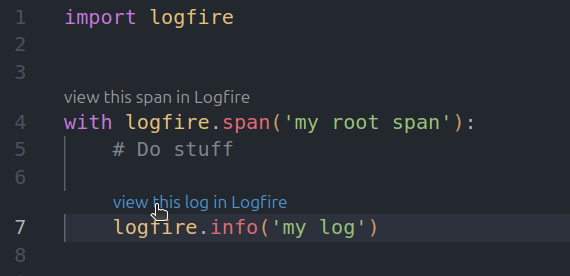

# Logfire extension for VSCode

A Visual Studio Code extension for the [Logfire platform](https://logfire.pydantic.dev/docs/).

> [!WARNING]
>
> This project is in early development.

    <picture>
      
    </picture>

## Installation

The extensions is available on the [Visual Studio Marketplace](TODO).

The extension requires [project credentials](https://logfire.pydantic.dev/docs/#about-logfire) to be set up
(in the `.logfire/` directory at the root of your project).
